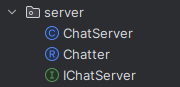
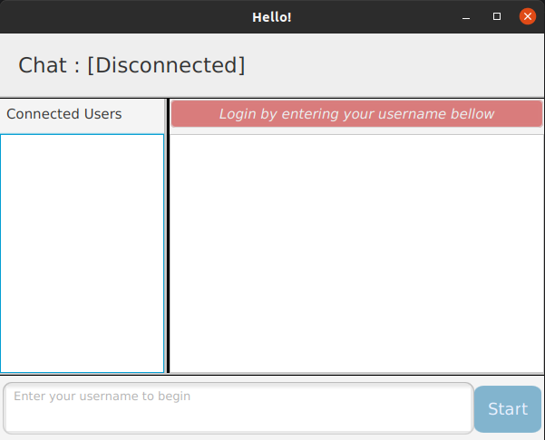
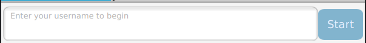
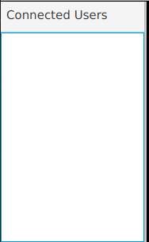
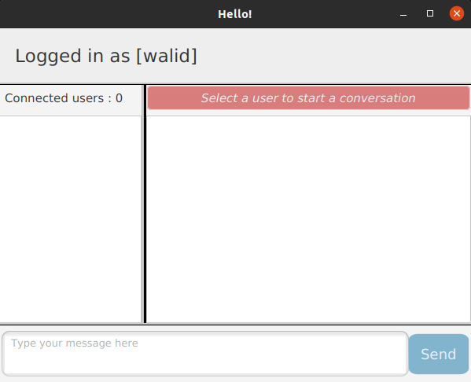
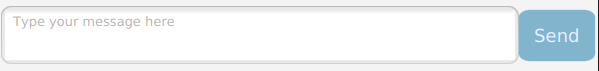
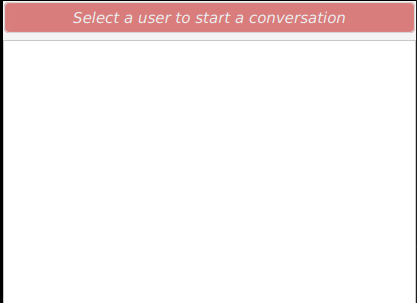
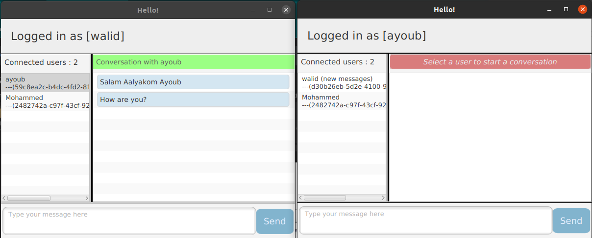
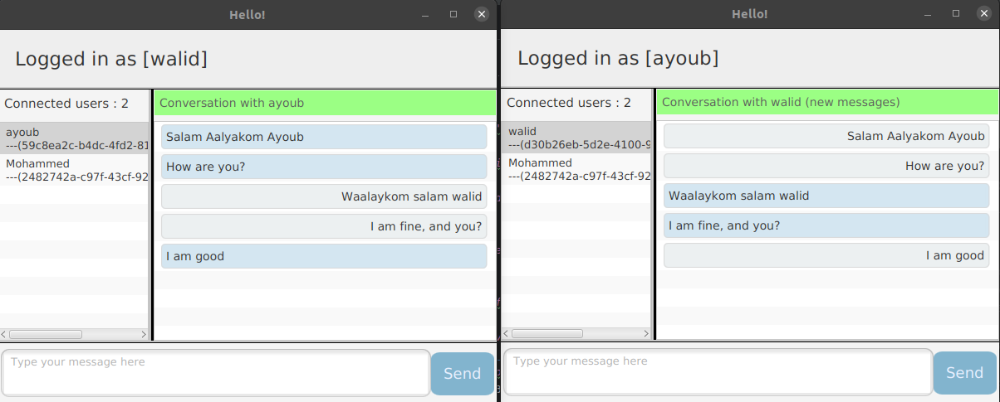
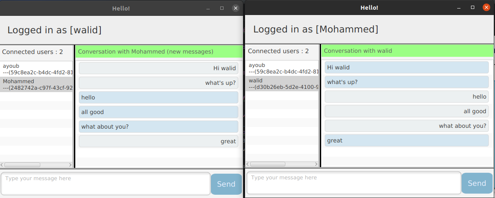

# Rapport de projet de Securite des Systemes d'information
### ILISI3 - Projet: Application de chat sécurisé
### Réalisé par: `Walid AHDOUF` 
## Introduction
Ce projet a pour but de mettre en place d'une application desktop de chat sécurisé. L'application est développée en Java et utilise le protocole TLS pour sécuriser les communications entre les utilisateurs. Le protocole TLS est implémenté à l'aide de la librairie BouncyCastle. L'application utilise le protocole TLS pour sécuriser les communications entre les utilisateurs. Le protocole TLS est implémenté à l'aide de la librairie BouncyCastle. L'application utilise le protocole TLS pour sécuriser les communications entre les utilisateurs. Le protocole TLS est implémenté à l'aide de la librairie BouncyCastle. L'application utilise le protocole TLS pour sécuriser les communications entre les utilisateurs. Le protocole TLS est implémenté à l'aide de la librairie BouncyCastle. 
L'application utilise RMI pour echange des messages entre les utilisateurs en passant par un serveur (RMI Registry).
l'application permet de créer un compte utilisateur, de se connecter et de discuter avec les autres utilisateurs connectés.
l'application utilise le protocol de chiffrement RSA pour sécuriser les communications entre les utilisateurs, donc chaque utilisateur possède une paire de clés (publique et privée) pour chiffrer et déchiffrer les messages.
## Architecture
L'application est composée de 3 parties:
- Client: l'interface graphique de l'application et le module de chiffrement des messages (RSA) avec des tests unitaires pour chaque fonctionnalité.
- Server: le serveur RMI
- 
- Common: les classes communes entre le client et le serveur

## Fonctionnalités
### I- Interface Initiale de l'application

#### 1- Connexion à l'application avec un username

#### 2- recherche automatique des utilisateurs connectés au serveur apres la connexion avec un username (RMI Registry)

### II- Interface principale de l'application

#### 1- envoi de messages chiffrés entre les utilisateurs

#### 2- zone de conversation avant selection d'un utilisateur

### => demo de l'application en cours d'execution
Dans cette demo, on va lancer 3 instances de l'application sur 3 utilisateurs différents (`walid`, `ayoub`, `Mohammed`), et on va voir comment ils vont communiquer entre eux.
Dans la première instance, on va se connecter avec l'utilisateur `walid`, et on va voir que l'application va détecter les autres utilisateurs connectés au serveur (`ayoub`, `Mohammed`).
l'utilisateur walid va envoyer un message chiffré à l'utilisateur `ayoub`, et on va voir que l'utilisateur ayoub va recevoir le message chiffré et il va le déchiffrer implicitement.
on voit qu'il a envoye deux messages et l'utilisateur `ayoub` a un message a coté du nom de `walid`, cela veut dire qu'il a un message non lu (`new messages`).
aussi il peut voir que que les deux voient que deux utilisateurs sont connectés (`ayoub` et `Mohammed` dans l'interface de `walid`) sauf lui.
le titre de la conversation se change automatiquement et change vers une arriere plan verte indiquant que l'utilisateur est connecte et il a selectionne un utilisateur avec qui il va communiquer.

#### NB: pour eviter la repetition des username, on a ajoute un ID unique generer automatiquement pour chaque utilisateur, donc on peut avoir deux utilisateurs avec le meme username mais avec des ID differents.
### =>  cas de communication et va et vient des messages entre les utilisateurs `walid` et `ayoub`

### => cas de communication et va et vient des messages entre les utilisateurs `walid` et `Mohammed`

